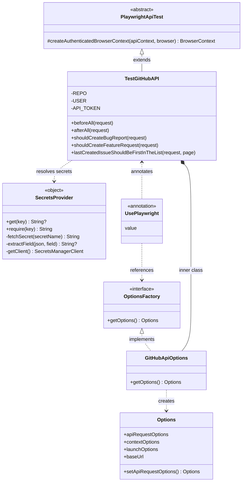
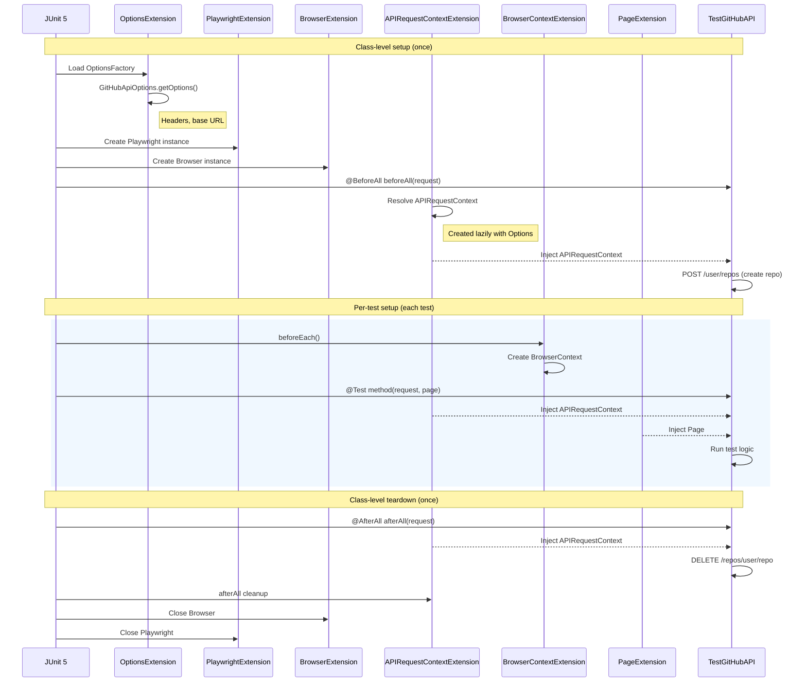
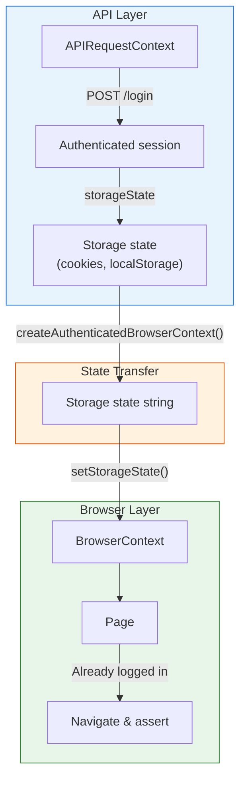
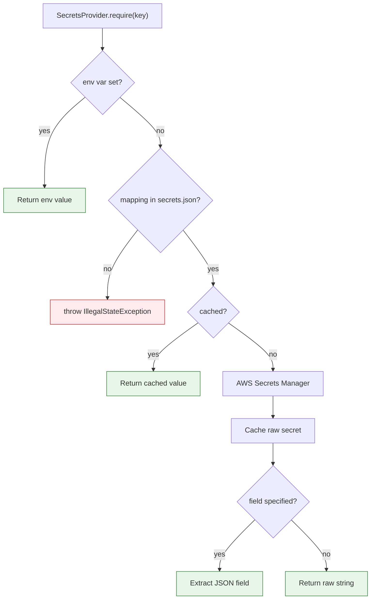

# API Testing

Playwright can test REST APIs without launching a browser, using `APIRequestContext`. The `oscarvarto.mx.api` package
demonstrates this with a GitHub Issues API test suite.

Reference: <https://playwright.dev/java/docs/api-testing>

## Architecture



The design separates concerns across four components:

- **`PlaywrightApiTest`** (abstract) — provides `createAuthenticatedBrowserContext()` for transferring API
  authentication state into a browser context. Annotated with `@TestInstance(PER_CLASS)` so `@BeforeAll` / `@AfterAll`
  can be instance methods with parameter injection.
- **`TestGitHubAPI`** — concrete test class. Uses `@UsePlaywright(GitHubApiOptions::class)` to wire GitHub-specific
  configuration, and extends `PlaywrightApiTest` for the auth-reuse utility.
- **`GitHubApiOptions`** — inner `OptionsFactory` that configures the `APIRequestContext` with GitHub's base URL and
  auth headers.
- **`SecretsProvider`** — Kotlin `object` that resolves test secrets such as `GITHUB_USER` and `GITHUB_API_TOKEN` via an
  env-var-first strategy with AWS Secrets Manager fallback. See [Secrets management](#secrets-management).

## Opt-in execution

`TestGitHubAPI` is a real external integration test, not a default unit-test suite.

It is skipped unless you explicitly enable it with:

```zsh
-Dplaywright.github.integration.enabled=true
```

This keeps `./gradlew build` safe by default on machines that do not have GitHub credentials configured.

### Browser configuration file

The `playwright.json` file lives on the test classpath (typically `src/test/resources/playwright.json`):

```json
{ "playwright": { "browser": "chromium", "headless": true } }
```

## How `@UsePlaywright` works

The `@UsePlaywright` annotation is a meta-annotation that registers six JUnit 5 extensions, each responsible for one
Playwright object's lifecycle and parameter injection:

| Extension                    | Creates             | Scope    |
| ---------------------------- | ------------------- | -------- |
| `OptionsExtension`           | `Options`           | class    |
| `PlaywrightExtension`        | `Playwright`        | class    |
| `BrowserExtension`           | `Browser`           | class    |
| `BrowserContextExtension`    | `BrowserContext`    | per-test |
| `PageExtension`              | `Page`              | per-test |
| `APIRequestContextExtension` | `APIRequestContext` | per-test |

The `OptionsFactory` (here `GitHubApiOptions`) feeds configuration to these extensions. Each extension implements
`ParameterResolver`, so test methods and `@BeforeAll` / `@AfterAll` receive Playwright objects as method parameters
rather than managing them manually.



Key takeaway: you never manually create or close `Playwright`, `Browser`, or `APIRequestContext`. The extensions handle
that entirely. Your test methods simply declare what they need as parameters.

## Authentication state reuse

`PlaywrightApiTest` provides `createAuthenticatedBrowserContext()` which bridges the API and browser layers. This is
useful for web apps that use cookie-based authentication: authenticate once via fast API calls, then transfer that
session to a browser context for UI assertions.



The pattern in code:

```kotlin
@Test
fun verifyDashboardAfterApiLogin(api: APIRequestContext, browser: Browser) {
    // 1. Authenticate via API (fast, no browser needed)
    api.post("/login", RequestOptions.create().setData(credentials))

    // 2. Transfer auth state to a browser context
    createAuthenticatedBrowserContext(api, browser).use { ctx ->
        val page = ctx.newPage()
        page.navigate("https://example.com/dashboard")

        // 3. Page is already logged in — assert directly
        assertThat(page.locator("h1")).hasText("Welcome")
    }
}
```

> **Note:** this pattern works for services that store authentication as cookies. Token-based APIs such as GitHub's
> `Authorization` header do not set cookies, so the `TestGitHubAPI` tests use the injected `APIRequestContext` directly
> for API calls, and the injected `Page` for browser navigation on public pages.

## Secrets management

Test secrets such as `GITHUB_USER` and `GITHUB_API_TOKEN` are resolved through `SecretsProvider` (`oscarvarto.mx.aws`),
which uses an env-var-first strategy:

1. **Environment variable** — `System.getenv(key)`. If present, the value is returned immediately and no AWS call is
   made. This is the default path for local development.
2. **AWS Secrets Manager** — looked up via the mapping in `secrets.json` on the test classpath. Useful in CI or shared
   environments where secrets live in a central store.



Configuration lives in `src/test/resources/secrets.json`:

```json
{
  "secrets": {
    "region": "us-east-1",
    "mappings": {
      "GITHUB_USER": {
        "secretName": "playwright-practice/github",
        "field": "username"
      },
      "GITHUB_API_TOKEN": {
        "secretName": "playwright-practice/github",
        "field": "token"
      }
    }
  }
}
```

Multiple logical keys can point to the same `secretName`. Only one AWS API call is made, and the result is cached
in-memory for the duration of the test run. The `SecretsManagerClient` is created lazily and is never instantiated if
all secrets come from environment variables.

**Running tests:**

```zsh
# Local dev — explicitly enable the GitHub integration suite
GITHUB_USER=x GITHUB_API_TOKEN=y \
  ./gradlew test \
  -Dplaywright.github.integration.enabled=true \
  --tests "*.TestGitHubAPI"

# CI with secrets configured through SecretsProvider
./gradlew test \
  -Dplaywright.github.integration.enabled=true \
  --tests "*.TestGitHubAPI"
```
