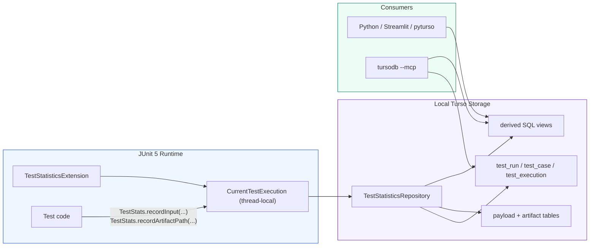
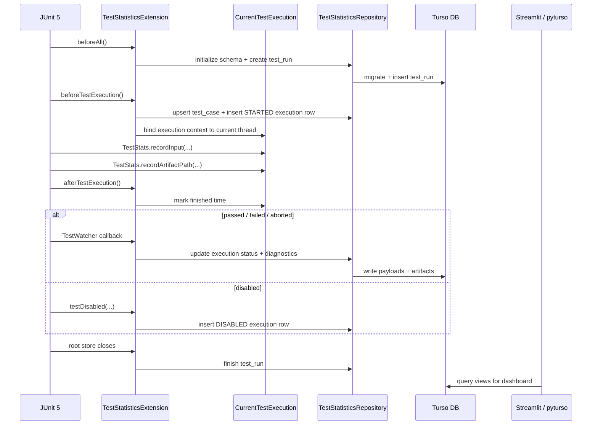
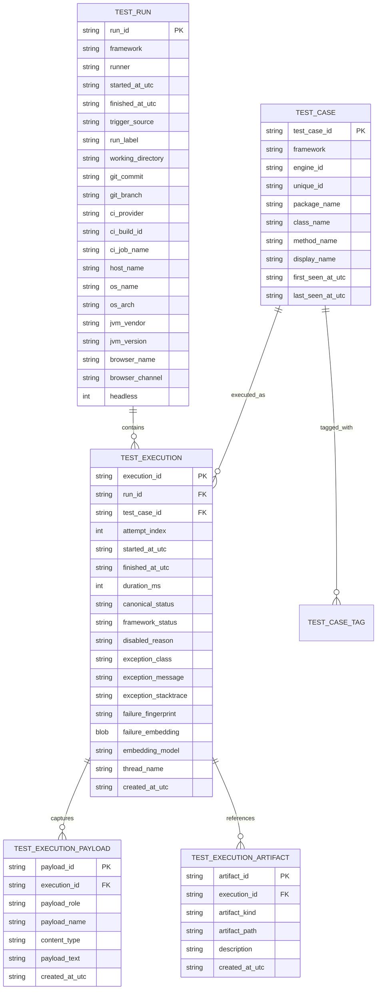
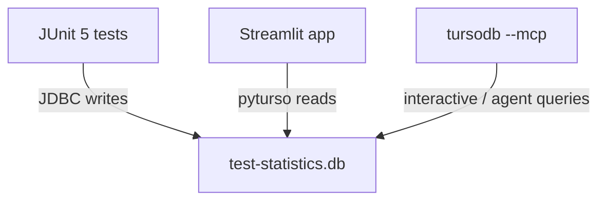
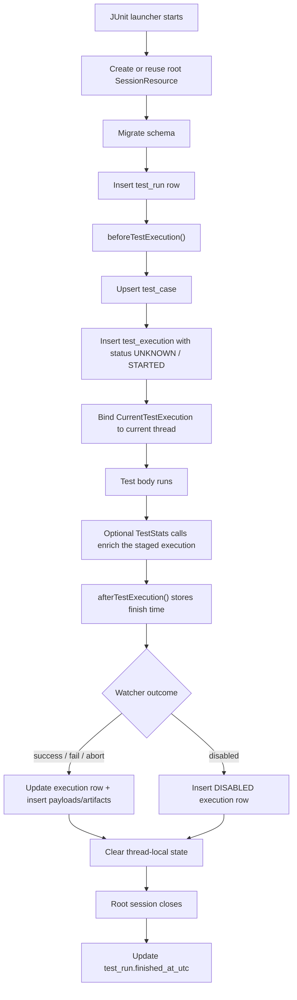

# Turso Test Statistics

The test suite includes a global JUnit 5 statistics pipeline backed by the local Turso database file at
`src/test/resources/test-statistics.db`.

This design exists to answer questions that basic green/red test output cannot answer well:

- Which tests are becoming flaky?

  A test is "flaky" when it sometimes passes and sometimes fails without any code change. The simplest way to detect
  this is to look at the full execution history for each test and count how many times the outcome switched — for
  example, a sequence of PASSED, PASSED, FAILED, PASSED has two switches (one from PASSED to FAILED, and one back to
  PASSED). The more switches ("flips"), the more unstable the test. A test that has never failed, or one that always
  fails, has zero flips and is not flaky — it is just consistently green or consistently red.

  Alongside the flip count, the historical pass rate tells you what fraction of all runs ended in success. A test with a
  50 % pass rate and many flips is a strong flaky candidate.

  Formally, for a logical test case $c$ with ordered executions $e_{1}, \dots, e_{n}$ from `test_execution`, define a binary
  outcome sequence $x_i \in \{0,1\}$ where $x_i = 1$ for `PASSED` and $x_i = 0$ for `FAILED` or `ABORTED`. The
  instability score is the number of status flips:\
  $$F_c = \sum_{i=2}^{n} \mathbf{1}[x_i \ne x_{i-1}]$$

  and the historical pass rate is $\bar{p}_c = \frac{1}{n} \sum_{i=1}^{n} x_i$

  Tests with both passes and failures and a growing $F_c$ are natural flaky candidates. This is the rationale behind
  `v_flaky_candidates`, built from `test_execution` and keyed by `test_case_id`.

- Which failures are recurring with the same fingerprint?

  When a test fails, the system computes a short hash (a "fingerprint") from the exception class, the relevant stack
  frame, and the first line of the error message. Two failures that share the same fingerprint almost certainly share
  the same root cause, even if they happen in different tests or different runs.

  Two numbers matter for each fingerprint. The first is the **occurrence count**: how many times that exact fingerprint
  has been seen across all executions. A high count means the same bug keeps triggering. The second is the **affected
  test count**: how many distinct test cases have produced that fingerprint. If only one test is affected, the problem
  is likely local to that test. If many tests share the fingerprint, the failure is systemic — probably a shared
  dependency, a flaky service, or an environment issue.

  Formally, if each failing execution stores a fingerprint $g(e)$ in
  `test_execution.failure_fingerprint`, then recurrence is a frequency count:\
  $$N_f = \sum_{e \in E} \mathbf{1}[g(e) = f]$$

  and cross-test spread is:\
  $$A_f = \left| \{ c(e) : g(e) = f \} \right|$$

  where $c(e)$ is the logical test case for execution $e$. Large $N_f$ means the same root cause is repeating; large
  $A_f$ means that failure mode is systemic. This is what `v_failure_fingerprints` summarizes from `test_execution`.

- Which tests are slow on average or highly variable?

  Every test execution records how long it took in milliseconds. Across many runs of the same test, the **mean
  duration** tells you whether the test is inherently slow. But the mean alone can be misleading: a test that usually
  takes 100 ms but occasionally spikes to 2 000 ms has a moderate mean yet a serious stability problem.

  To capture that variability, the dashboard computes the **standard deviation** — a measure of how spread out the
  durations are. A small standard deviation means the test runs in roughly the same time every time; a large one means
  the runtime swings widely.

  Because a 50 ms standard deviation means something very different for a test averaging 100 ms versus one averaging 10
  000 ms, the dashboard also computes the **coefficient of variation** (CV): the standard deviation divided by the mean.
  A CV near zero means the test is stable; a CV above 1.0 means the runtime varies more than the average itself — a
  strong signal of environmental sensitivity, resource contention, or non-deterministic waits.

  Formally, for durations $d_1, \dots, d_n$ stored in `test_execution.duration_ms` for a given `test_case_id`, the mean
  runtime is:\
  $$\mu_c = \frac{1}{n} \sum_{i=1}^{n} d_i$$

  and the sample variance is:\
  $$s_c^2 = \frac{1}{n-1} \sum_{i=1}^{n} (d_i - \mu_c)^2$$

  The coefficient of variation is then:\
  $$\mathrm{CV}_c = \frac{s_c}{\mu_c}$$

  High $\mu_c$ identifies slow tests; high $\mathrm{CV}_c$ identifies unstable runtimes. The current schema exposes the
  raw durations in `test_execution` and aggregates in `v_test_case_quality`.

- How does quality trend over time across local runs and CI runs?

  Looking at a single run tells you whether it was green or red, but it does not show whether things are getting better
  or worse. To see trends, the dashboard groups all test executions by calendar day and computes the **daily pass
  rate**: the number of passed executions divided by the total number of executions that day. Plotting this over time
  reveals whether recent changes are improving or degrading the suite.

  Because local developer runs and CI pipeline runs can behave differently (different environments, different subsets of
  tests), the dashboard also breaks the daily pass rate down by **trigger source**. This lets you spot problems that
  only appear in one environment — for example, a test that always passes locally but fails in CI due to a missing
  service.

  The same idea applies at the individual run level: each run's pass rate is the fraction of its executions that ended
  in PASSED.

  Formally, let $d(e)$ be the UTC day of execution $e$, let $u(e)$ be its source (one of `local`, `github-actions`,
  `gitlab-ci`, `jenkins`, `azure-pipelines`, `circleci`, or `generic-ci` as detected by
  `TestRunContextCollector.detectCiProvider()`), let $\sigma(e)$ be its final status, and let $\rho(e)$ be its run
  identifier. The daily pass-rate trend by source is:\
  $$q_{t,s} = \frac{\left| \{ e \in E : d(e) = t \wedge u(e) = s \wedge \sigma(e) = \mathrm{PASSED} \} \right|}{\left| \{ e \in E : d(e) = t \wedge u(e) = s \} \right|}$$

  At the run level, the same idea becomes:\
  $$q_r = \frac{\left| \{ e \in E : \rho(e) = r \wedge \sigma(e) = \mathrm{PASSED} \} \right|}{\left| \{ e \in E : \rho(e) = r \} \right|}$$

  These quantities are supported by joining `test_execution` with `test_run.trigger_source` and
  `test_run.started_at_utc`, and they are exposed in derived form through `v_run_summary` and `v_daily_status_trend`.

- Which inputs or artifacts were associated with a failure?

  When a test fails, knowing *what* was fed into it and *what* it produced is often more useful than the stack trace
  alone. The schema supports this through two attachment tables: one for **payloads** (structured inputs that the test
  recorded explicitly, such as request bodies or configuration maps) and one for **artifacts** (file references like
  Playwright traces, screenshots, or log dumps).

  Both tables are keyed by `execution_id`, so you can always look up exactly which inputs and outputs were associated
  with a specific failure. At the simplest level this is just traceability: pick a failed execution and see everything
  attached to it.

  At a more analytical level, if a particular payload value or artifact type shows up disproportionately among failures,
  that is a signal worth investigating. For example, if 80 % of failures involve the payload `{"tenant": "acme"}`, the
  problem may be tenant-specific.

  Formally, the schema stores explicit inputs in `test_execution_payload` and artifact references in
  `test_execution_artifact`, both keyed by `execution_id`. That makes each failure analyzable as a join over the failure
  cohort:\
  $$\mathcal{F} = \{ e \in E : \mathrm{status}(e) = \texttt{FAILED} \}$$

  For any payload value or artifact class $z$, its failure association rate is:\
  $$P(z \mid \mathcal{F}) \approx \frac{\left| \{ e \in \mathcal{F} : z \text{ is attached to } e \} \right|}{|\mathcal{F}|}$$

  Even when no broad frequency model is needed, the database design guarantees exact traceability: one can always
  recover the payloads and artifact paths attached to a specific failed execution by joining on `execution_id`.

## Design goals

- **Automatic collection** for all JUnit 5 tests through a globally registered extension.
- **Framework-neutral schema** even though the current implementation targets JUnit 5 first.
- **One row per actual test attempt** so retries and pass/fail flips are not lost.
- **Raw execution facts plus SQL views** so Python dashboards can query stable, ready-to-visualize tables.
- **Local-first operation** using JDBC writes and file-based reads, with optional MCP access through `tursodb`.

## Python analysis workflow

Create a pixi environment with the following packages needed for read-side analytics:

- `pyturso` for database access, imported in Python as `turso`
- `polars` for DataFrame-style analytics
- `streamlit` for dashboards
- `pandas` if a library expects it
- `plotly` for interactive time-series and scatter plots directly in Streamlit

### Minimal Python helper

The `turso` package returns tuple rows. For dashboard code, a small helper that converts a query result into a Polars
`DataFrame` keeps the rest of the code simple. The actual implementation lives in `python-analysis/db.py` and resolves
the database path via Streamlit secrets first, falling back to a relative path:

```python
from pathlib import Path

import polars as pl
import turso

_DEFAULT_DB_PATH = (
    Path(__file__).resolve().parent.parent
    / "src" / "test" / "resources" / "test-statistics.db"
)


def _db_path() -> str:
    try:
        import streamlit as st
        return st.secrets["db"]["path"]
    except Exception:
        return str(_DEFAULT_DB_PATH)


def query_frame(sql: str, params: tuple = ()) -> pl.DataFrame:
    conn = turso.connect(_db_path())
    try:
        cur = conn.cursor()
        cur.execute(sql, params)
        columns = [column[0] for column in cur.description]
        rows = cur.fetchall()
        return pl.DataFrame(
            [dict(zip(columns, row, strict=False)) for row in rows]
        )
    finally:
        conn.close()
```

If the file is temporarily locked because tests are actively writing to it, a practical workaround for dashboard
development is to read from a copied snapshot of `test-statistics.db`.

### Which tests are becoming flaky?

> **pyturso limitation:** The `v_flaky_candidates` view uses a CTE with a correlated subquery to find each
> execution's immediately preceding status, which `pyturso` does not support. The dashboard therefore queries raw
> tables and replicates the view logic in Polars using `pl.Expr.shift().over()`. See
> `python-analysis/pages_impl/flaky_candidates.py` for the full implementation.

The conceptual approach is: fetch every execution ordered chronologically per test case, compute status flips with
`shift()`, aggregate, and filter to tests with both passes and failures:

```python
raw = query_frame(
    """
    SELECT
        te.test_case_id, te.execution_id, te.canonical_status, te.attempt_index,
        COALESCE(te.started_at_utc, te.created_at_utc) AS sort_ts,
        tc.class_name, tc.method_name
    FROM test_execution te
    JOIN test_case tc ON tc.test_case_id = te.test_case_id
    ORDER BY te.test_case_id, sort_ts, te.attempt_index, te.execution_id
    """
)

with_prev = raw.with_columns(
    pl.col("canonical_status").shift(1).over("test_case_id").alias("previous_status")
)

flaky_candidates = (
    with_prev.group_by("test_case_id", "class_name", "method_name")
    .agg(
        (pl.col("canonical_status") == "PASSED").sum().alias("pass_count"),
        (pl.col("canonical_status") == "FAILED").sum().alias("fail_count"),
        (
            pl.col("previous_status").is_not_null()
            & (pl.col("previous_status") != pl.col("canonical_status"))
        ).sum().alias("flip_count"),
    )
    .filter((pl.col("pass_count") > 0) & (pl.col("fail_count") > 0))
)
```

For Streamlit:

```python
import streamlit as st

st.subheader("Flaky candidates")
st.dataframe(flaky_candidates, width="stretch")
```

### Which failures are recurring with the same fingerprint?

> **pyturso limitation:** The `v_failure_fingerprints` view uses correlated scalar subqueries to pick the most recent
> exception details per fingerprint, which `pyturso` does not support. The dashboard therefore queries the raw
> `test_execution` table and replicates the view logic in Polars using `sort().group_by().first()`. See
> `python-analysis/pages_impl/failure_fingerprints.py` for the full implementation.

The conceptual approach is: fetch all executions with a non-null fingerprint, aggregate per fingerprint, and pick the
most recent exception details:

```python
raw = query_frame(
    """
    SELECT
        failure_fingerprint, test_case_id, exception_class, exception_message,
        COALESCE(finished_at_utc, created_at_utc) AS seen_at, execution_id
    FROM test_execution
    WHERE failure_fingerprint IS NOT NULL
    ORDER BY failure_fingerprint, seen_at DESC, execution_id DESC
    """
)

agg = raw.group_by("failure_fingerprint").agg(
    pl.len().alias("occurrence_count"),
    pl.col("test_case_id").n_unique().alias("affected_test_count"),
    pl.col("seen_at").min().alias("first_seen_at"),
    pl.col("seen_at").max().alias("last_seen_at"),
)

latest = (
    raw.sort("seen_at", "execution_id", descending=[True, True])
    .group_by("failure_fingerprint").first()
    .select(
        "failure_fingerprint",
        pl.col("exception_class").alias("last_exception_class"),
        pl.col("exception_message").alias("sample_message"),
    )
)

failure_fingerprints = agg.join(latest, on="failure_fingerprint", how="left")
print(failure_fingerprints.head(20))
```

A useful triage pattern is to drill from one fingerprint back to the concrete executions:

```python
fingerprint = failure_fingerprints.item(0, "failure_fingerprint")

matching_failures = query_frame(
    """
    SELECT
        te.execution_id,
        te.finished_at_utc,
        te.exception_class,
        te.exception_message,
        tc.class_name,
        tc.method_name,
        tr.run_id,
        tr.trigger_source
    FROM test_execution te
    JOIN test_case tc ON tc.test_case_id = te.test_case_id
    JOIN test_run tr ON tr.run_id = te.run_id
    WHERE te.failure_fingerprint = ?
    ORDER BY te.finished_at_utc DESC
    """,
    (fingerprint,),
)
```

### Which tests are slow on average or highly variable?

You can answer this from raw execution durations and compute the mean, standard deviation, and coefficient of variation
in Polars:

```python
durations = query_frame(
    """
    SELECT
        tc.class_name,
        tc.method_name,
        te.duration_ms
    FROM test_execution te
    JOIN test_case tc ON tc.test_case_id = te.test_case_id
    WHERE te.duration_ms IS NOT NULL
    """
)

duration_stats = (
    durations
    .group_by("class_name", "method_name")
    .agg(
        pl.len().alias("execution_count"),
        pl.col("duration_ms").mean().alias("mean_duration_ms"),
        pl.col("duration_ms").std().alias("std_duration_ms"),
        pl.col("duration_ms").min().alias("min_duration_ms"),
        pl.col("duration_ms").max().alias("max_duration_ms"),
    )
    .with_columns(
        pl.when(pl.col("mean_duration_ms") > 0)
        .then(pl.col("std_duration_ms") / pl.col("mean_duration_ms"))
        .otherwise(None)
        .alias("cv_duration")
    )
    .sort(
        ["cv_duration", "mean_duration_ms"],
        descending=[True, True],
        nulls_last=True,
    )
)

print(duration_stats.head(20))
```

If you only need pre-aggregated quality data, start from `v_test_case_quality` and compute extra derived metrics in
Python:

```python
test_case_quality = query_frame(
    """
    SELECT
        class_name,
        method_name,
        total_executions,
        pass_rate,
        fail_rate,
        average_duration_ms,
        min_duration_ms,
        max_duration_ms,
        last_failed_at
    FROM v_test_case_quality
    ORDER BY average_duration_ms DESC
    """
)
```

### How does quality trend over time across local runs and CI runs?

`v_daily_status_trend` gives an overall daily trend. To split by local versus CI source, join `test_execution` with
`test_run` and aggregate by `trigger_source`:

```python
daily_quality_by_source = (
    query_frame(
        """
        SELECT
            substr(tr.started_at_utc, 1, 10) AS day_utc,
            tr.trigger_source,
            COUNT(*) AS total_executions,
            SUM(CASE WHEN te.canonical_status = 'PASSED' THEN 1 ELSE 0 END) AS passed_count,
            SUM(CASE WHEN te.canonical_status = 'FAILED' THEN 1 ELSE 0 END) AS failed_count,
            SUM(CASE WHEN te.canonical_status = 'ABORTED' THEN 1 ELSE 0 END) AS aborted_count,
            SUM(CASE WHEN te.canonical_status = 'DISABLED' THEN 1 ELSE 0 END) AS disabled_count
        FROM test_execution te
        JOIN test_run tr ON tr.run_id = te.run_id
        GROUP BY 1, 2
        ORDER BY 1, 2
        """
    )
    .with_columns(
        (pl.col("passed_count") / pl.col("total_executions")).alias("pass_rate"),
        (pl.col("failed_count") / pl.col("total_executions")).alias("fail_rate"),
    )
)

print(daily_quality_by_source)
```

For a Streamlit overview page:

```python
import streamlit as st

st.subheader("Daily pass rate by source")
st.dataframe(daily_quality_by_source, width="stretch")
```

With `plotly`, this dataset is immediately usable for a multi-series trend chart keyed by `trigger_source`.

### Which inputs or artifacts were associated with a failure?

Use one query to find recent failed executions and then drill into payloads and artifacts by `execution_id`:

```python
recent_failures = query_frame(
    """
    SELECT
        te.execution_id,
        te.finished_at_utc,
        te.failure_fingerprint,
        te.exception_class,
        te.exception_message,
        tc.class_name,
        tc.method_name
    FROM test_execution te
    JOIN test_case tc ON tc.test_case_id = te.test_case_id
    WHERE te.canonical_status = 'FAILED'
    ORDER BY te.finished_at_utc DESC
    LIMIT 20
    """
)

execution_id = recent_failures.item(0, "execution_id")

failure_payloads = query_frame(
    """
    SELECT
        payload_role,
        payload_name,
        content_type,
        payload_text
    FROM test_execution_payload
    WHERE execution_id = ?
    ORDER BY created_at_utc
    """,
    (execution_id,),
)

failure_artifacts = query_frame(
    """
    SELECT
        artifact_kind,
        artifact_path,
        description
    FROM test_execution_artifact
    WHERE execution_id = ?
    ORDER BY created_at_utc
    """,
    (execution_id,),
)
```

This is the most direct way to implement a Streamlit failure-detail page: one table for recent failures, one table for
payloads, and one table for artifact references selected by `execution_id`.

## JVM native access

The preview Turso Java binding loads native code. Because of that, the Gradle `Test` task is configured with:

```text
--enable-native-access=ALL-UNNAMED
```

Without that flag, recent JDKs emit warnings about restricted native access when the Turso library calls
`System.loadLibrary(...)`.

## Runtime architecture



## End-to-end data flow



## Database location and lifecycle

- Default file: `src/test/resources/test-statistics.db`
- Sidecar files may appear while the database is open: `test-statistics.db-wal`, `test-statistics.db-shm`
- These files are treated as generated local state and are ignored by Git
- The extension creates the database lazily if it does not exist
- Schema migrations run automatically before data is written

Default configuration uses system properties:

| Property                         | Default                                 | Purpose                                                         |
| -------------------------------- | --------------------------------------- | --------------------------------------------------------------- |
| `test.statistics.enabled`        | `true`                                  | Enables or disables the whole pipeline                          |
| `test.statistics.db.path`        | `src/test/resources/test-statistics.db` | Overrides the database file path                                |
| `test.statistics.run.label`      | unset                                   | Optional label for a test run                                   |
| `test.statistics.artifacts.root` | unset                                   | Optional base directory used to resolve relative artifact paths |

## Why a separate `test_run` table?

The schema distinguishes between:

- a **test run**: one launcher session in one JVM
- a **test case**: the stable identity of a logical test across runs
- a **test execution**: one actual attempt of that test case in a specific run

That separation is what makes historical analysis possible. If all data were stored in one denormalized table, important
concepts such as pass/fail transitions, cross-run test identity, or failure clustering would be harder to query
accurately.

## Raw schema

The schema is split into:

- **dimensions / identities**: `test_run`, `test_case`, `test_case_tag`
- **facts**: `test_execution`
- **attachments**: `test_execution_payload`, `test_execution_artifact`
- **migration bookkeeping**: Flyway's `flyway_schema_history`



## Stable test identity

`test_case.test_case_id` is computed as:

```text
sha256("junit5|" + ExtensionContext.getUniqueId())
```

This is important because:

- method names alone are not enough for parameterized or dynamic tests
- the JUnit unique ID preserves the engine-level logical identity
- the database can track the same logical test across many runs without depending on fragile string matching

## Status model

Two status fields are stored:

- `canonical_status`: normalized status used by analytics and dashboards
- `framework_status`: framework-native status for debugging and future adapters

Current JUnit 5 mapping:

| JUnit outcome | `canonical_status` | `framework_status` |
| ------------- | ------------------ | ------------------ |
| success       | `PASSED`           | `SUCCESSFUL`       |
| failure       | `FAILED`           | `FAILED`           |
| abort         | `ABORTED`          | `ABORTED`          |
| disabled      | `DISABLED`         | `DISABLED`         |

Reserved canonical statuses already exist in the schema for future expansion:

- `SKIPPED`
- `BLOCKED`
- `UNKNOWN`

## Failure fingerprinting

Each failed or aborted execution can store a `failure_fingerprint`, computed from:

- exception class
- preferred stack-frame location (format: `ClassName#methodName`)
- normalized first-line exception message

The preferred frame selection favors project code under `oscarvarto.mx` and only falls back to the first non-framework
frame if needed.

This allows queries such as:

- "Show me all recurring failures with the same root cause"
- "Which tests are failing for the same reason?"
- "When did this failure fingerprint first appear?"

### Why line numbers are omitted

The preferred frame format is `ClassName#methodName` — line numbers are intentionally excluded. This makes the
fingerprint stable across refactors that shift line numbers (adding or removing lines above the failure site). Two
failures in the same method with the same exception and message are almost always the same root cause, so the loss of
line-level precision is a worthwhile trade-off for fingerprint stability across commits.

## Future: vector similarity search

The `test_execution` table includes two nullable columns reserved for future vector-based similarity search:

| Column              | Type   | Purpose                                                                 |
| ------------------- | ------ | ----------------------------------------------------------------------- |
| `failure_embedding` | `BLOB` | Vector embedding of the failure signature (e.g. via Turso `vector32()`) |
| `embedding_model`   | `TEXT` | Identifies the model that produced the embedding                        |

Both columns are currently unpopulated. The planned approach:

1. **At test-report time**, embed the concatenation of `exceptionClass + normalizedMessage + preferredFrame` using a
   local ONNX Runtime model (e.g. `all-MiniLM-L6-v2`).
2. **Store the resulting vector** in `failure_embedding` and record the model identifier in `embedding_model` (e.g.
   `"onnx:all-MiniLM-L6-v2"`), so stale embeddings can be detected after a model upgrade.
3. **In the Python dashboard**, use Turso's `vector_distance_cos()` function to find semantically similar failures
   across different fingerprints — surfacing failures that share the same root cause even when their deterministic
   hashes differ (e.g. slightly different error messages or different call sites).

This complements — but does not replace — the deterministic SHA-256 fingerprint. The hash provides exact grouping; the
embedding enables fuzzy similarity search.

## Explicit input and artifact capture

The system does not try to infer test input automatically in v1. Instead, tests opt in explicitly:

```kotlin
TestStats.recordInput(buildJsonObject {
    put("tenant", "acme")
    put("attempt", 1)
})
TestStats.recordArtifactPath("trace", Path.of("artifacts", "trace.zip"), "Playwright trace")
```

This is deliberate:

- explicit capture is predictable
- it avoids fragile reflection over arbitrary test parameters
- it keeps the schema useful for both UI tests and API tests

## Derived views

The dashboard is expected to read mostly from SQL views rather than raw tables.

| View                     | Purpose                                            |
| ------------------------ | -------------------------------------------------- |
| `v_run_summary`          | Per-run totals and duration aggregates             |
| `v_test_case_latest`     | Latest known outcome for each logical test         |
| `v_test_case_quality`    | Longitudinal pass/fail and duration stats per test |
| `v_flaky_candidates`     | Tests that have both pass and fail history         |
| `v_failure_fingerprints` | Grouped recurring failures                         |
| `v_daily_status_trend`   | Day-level trend metrics                            |

The `v_test_case_latest` view uses a `NOT EXISTS` anti-join with a 3-level tiebreaker (`finished_at_utc` >
`attempt_index` > `execution_id`) rather than a window function like `ROW_NUMBER`. This is a deliberate choice: it
avoids window function syntax that `pyturso` cannot execute, keeping the view queryable from all three access paths
(JDBC, `tursodb`, and `pyturso`).

## Correlated subquery support across access paths

The SQL views `v_flaky_candidates` and `v_failure_fingerprints` use correlated subqueries (not window functions) to
avoid portability issues. These queries work correctly with:

- the `tursodb` CLI shell
- JDBC (JVM write path)

However, the `pyturso` Python driver **does not support** these correlated subqueries. This affects two views:

| View                     | SQL technique                | pyturso workaround                                       |
| ------------------------ | ---------------------------- | -------------------------------------------------------- |
| `v_flaky_candidates`     | CTE + correlated subquery    | `pl.Expr.shift().over()` in `flaky_candidates.py`        |
| `v_failure_fingerprints` | Correlated scalar subqueries | `sort().group_by().first()` in `failure_fingerprints.py` |

The remaining views (`v_run_summary`, `v_test_case_quality`, `v_test_case_latest`, `v_daily_status_trend`) use only
standard aggregation and work fine with all three access paths.

## Main write-path classes

| Class                          | Responsibility                                                  |
| ------------------------------ | --------------------------------------------------------------- |
| `TestStatisticsExtension`      | JUnit 5 integration and lifecycle orchestration                 |
| `TestStatisticsRepository`     | All writes to the Turso database                                |
| `TestStatisticsSchemaMigrator` | Flyway-backed schema bootstrap and legacy baseline transition   |
| `TestRunContextCollector`      | Collects run metadata and stable test identity                  |
| `CurrentTestExecution`         | Thread-local staging area for payloads and artifacts            |
| `TestStats`                    | Public helper API used by tests to enrich the current execution |

## Access patterns

The same database is designed to be used through three different access paths:



Recommended MCP command:

```zsh
/opt/homebrew/bin/tursodb src/test/resources/test-statistics.db --mcp
```

## Typical queries

Open the shell:

```zsh
/opt/homebrew/bin/tursodb src/test/resources/test-statistics.db
```

Recent run summary:

```sql
SELECT *
FROM v_run_summary
ORDER BY started_at_utc DESC
LIMIT 5;
```

Flaky candidates:

```sql
SELECT class_name, method_name, pass_count, fail_count, flip_count, latest_status
FROM v_flaky_candidates
ORDER BY flip_count DESC, fail_count DESC;
```

Recurring failure fingerprints:

```sql
SELECT failure_fingerprint, occurrence_count, affected_test_count, sample_message
FROM v_failure_fingerprints
ORDER BY occurrence_count DESC;
```

## Dashboard contract

The Python / Streamlit layer should treat the database as:

- **raw tables** for drill-down pages and for views that `pyturso` cannot query (see above)
- **views** for overview and trend pages where `pyturso` supports the underlying SQL

Suggested usage:

- use `v_run_summary` for the home page and overall run trends
- use `v_test_case_quality` for test-level quality tables
- use `v_daily_status_trend` for daily pass/fail trend charts
- query raw `test_execution` + `test_case` and compute flaky metrics in Polars (replaces `v_flaky_candidates`)
- query raw `test_execution` and compute fingerprint aggregations in Polars (replaces `v_failure_fingerprints`)
- use raw `test_execution_payload` and `test_execution_artifact` for detail views

For the full Streamlit implementation, see [`python-analysis/README.md`](../python-analysis/README.md).

## Operational notes

- The extension is auto-registered through JUnit service loading, so no test-class annotation is required
- The database path can be overridden for isolated test runs or experiments
- The implementation is concurrency-safe enough for the current class-level parallel execution model
- The current implementation writes through JDBC only; MCP is an inspection surface, not an ingestion path
- The integration tests in `oscarvarto.mx.teststats` verify schema creation, data capture, history accumulation, and
  derived view behavior
- The `teststats` launcher-fixture classes are intentionally gated so they only run when the integration harness turns
  them on; they are not meant to appear as standalone tests in a normal Gradle test scan

## Sequence of events during a normal test


